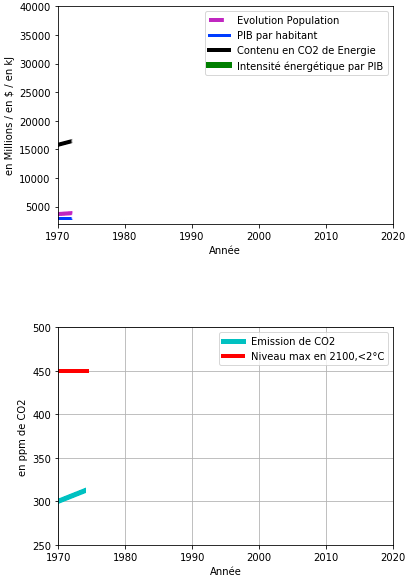

# Le réchauffement climatique

Notre projet consiste à modéliser l'évolution du réchauffement climatique sur la surface terrestre dont l'équilibre naturel est modifié par l'homme. 
Il est important de déterminer les causes et conséquences de ce déséquilibre, notamment l'émission accrue des gaz à effet de serre depuis le XIXème siècle.
Tout le monde est concerné et doit se mobiliser et agir pour conserver notre planète. à tous les niveaux. 
L'objectif de ce projet est de montrer l'urgence afin que la prise de conscience de chacun soit primordiale et que les mesures  et actions engagées soient poursuivies.
Une problèmatique urgente , vitale, non solutionnée, non finalisée et nécessite la responsabilité de chacun pour avancer.
Avec humilité, après étude et recherche effectuée sur ce sujet, nous prenons en compte la gravité et l'importance et la compléxité de la situation et il est trés difficile de trouver une solution avec une équation scientifique applicable qui pourrait satisfaire tout le monde, tous les acteurs.

Un économiste de l'Energie japonais, Yochi Kaya propose une équation liant 4 facteurs afin d'analyser et simuler l'évolution des émissions mondiales de CO2 dans le cadre des politiques de lutte contre le réchauffement climatique.

## Global warming

Our project is to model the evolution of global warming on the earth's surface, whose natural balance is modified by humans. It is important to determine the causes and consequences of this imbalance, in particular the emission of greenhouse gases since the 19th century. 
Everyone is concerned and must mobilize and act to conserve our planet. at all levels. 
The objective of this project is to show the urgency so that the price of everyone's conscience is essential and that the measures and actions taken will be continued. An urgent, vital problem, not resolved, not finalized and requires everyone's responsibility to move forward.
After study and research on this subject, we take into account the gravity and the importance and the complexity of the situation and it is very difficult to find a solution with an applicable scientific equation which could satisfy everyone, every country and all actors.

A Japanese energy economist, Yochi Kaya proposes an equation linking 4 factors in order to analyze and simulate the evolution of global CO2 emissions in the framework of policies to fight against global warming.

## Présentation de l'équipe

|(´・ω・｀)| ( ͡° ͜ʖ ͡°) | ಠ_ಠ | ᕕ( ᐛ )ᕗ |
|-----|--|--|--|
| L. Randriamanantena| A.Mawanzi Matoma | V.Vienne  | D.Aholou  |

## Description synthétique du projet

**Problématique :** " Les gaz à effet de serre sont majoritairement responsables des dérèglements climatiques"

**Hypothèse principale :** 

**Hypothèses secondaires :** 

**Objectifs :** "calcul et réduction du taux d'émission de gaz à effet de serre = taux du dioxyde de carbone CO2"
                " CO2=(CO2/TEP)×(TEP/PIB)×(PIB/P)×P "

**Critère(s) d'évaluation :** "par l'équation de Kaya, calculée en fonction de 
- l'activité humaine : déforestations,combustion de gaz et pétrole (énergie primaire) : CO2/TEP=IP : l'intensité de production de Co² par unité d'energie produite
- besoin énergétique pour l'économie, pour fournir un service ou produire un bien :TEP/PIB=IE : l'intensité énergetique de la production.
- l'activité économique : richesse, rémunération annuelle de l'humanité : PIB/P= PM : la production moyenne par habitant
- sur le nombre total de la population mondiale (Evolution de la population) : P

## Présentation structurée des résultats

- Représentation graphique des 4 courbes (facteurs indissociables) définissant l'équation
- 1 graphique sur la variation du C02 jusqu'à 2050 (marquant le niveau maximal (450ppm de CO²) afin d'atteindre l'objectif de limiter le rechauffement à 2°C d'ici 2050)

Présentation 
- situation probable, mécanisme théorique économique à établir, à développer : calcul du taux de variation de chaque paramètre (programmation)                       
Co²= P x PIB/p x TEP/PIB x Co²/TEP
Co² = production mondiale de Co²
P= la population mondiale .
Pib = le produit interieur brut mondial
Tep= la production d'energie
Co² = P x PM x IE x IP

Modélisation :

importer matplotlib
créer liste des abscisses x / ordonnées y
initialiser les listes
saisir l'équation de Kaya et les variables à utiliser, à déterminer

remplissage des listes (boucle FOR..;), saisie manuelles des données
construction du tableau avec matplotlib
affichage du tableau

déterminer les valeurs optimales d'équilibre : encalculant les différents coefficients

On veut calculer la variation d'un coef R (fixons pour IP' = R*IP), en supposant que les autres coef soient déterminés, 
On sait que Co²' = cCo²
P'xPM'xIE'xIP'=  cPxPMxIExIP
pP*pmPM*ieIE*IP' = cP*PM*IE*IP

faire entrer les coefficients : c,p,pm,ie,ip
IP' = (c/p*pm*ie)xIP
Résultat : R = (c/p*pm*ie)
si R<1 alors baisse de (1-R)%
si R>1 alors augmentation de (R-1)%
si R=1 alors inchangé, IP=IP'

Lors saisie des coefficients, filtrer les valeurs connues ou inconnue "x"
si ip = "x" alors R = c/(p*pm*ie)
si ie = "x" alors R = c/(p*pm*ip)
si pm = "x" alors R = c/(p*ip*ie)
si C = "x" alors R = p*pm*ie*ip
si p = "x" alors R = c/(ip*pm*ie)

Analyse et interprêtation des valeurs calculées

p : seuil à surveiller (taux de natalité et mortalité), p à -50%
pm : récession ou croissance
ie : ??
- cas particulier : tout diviser par 3 d'ici 2100 --> cas extrême, presque improbable mais à l'heure actuelle 2020 ; phénomène mondial inédit, arrêt de l'activité sur 2 mois, augmentation du taux de mortalité mondial, baisse CO2, récession à prévoir après reprise de l'économie (durée ; ??)

Présentation du choix de modélisation, des outils, du code et des résultats (tableaux, courbes, animations...) (**avec une analyse critique**).

## Lien vers page de blog : <a href="blog.html" target="_blank"> C'est ici ! </a>

## Lien test page externe : <a href="https://tanierandria98.wixsite.com/climat0/post/semaine-4-finalisation-du-dossier-analyse-et-critique-axes-d-am%C3%A9liorations" target="_blank"> Analyse & critiques - Axes d'amélioration </a>
## Conclusion:

Notre projet a l’état final se nomme “climat.ipynb”  

## Bibliographie :

**Carte mentale de vos mots-clés, en utilisant** <a href="https://framindmap.org/mindmaps/index.html" target="_blank">Framindmap </a> 

Liste de l'ensemble des ressources bibliographiques utilisées pour vos travaux. **<= Indiquez le canal utilisé pour les trouver (Google Scholar, sources wikipedia, ressources en ligne SU, ...)**

https://jancovici.com/changement-climatique/economie/quest-ce-que-lequation-de-kaya/
http://www.carbone4.com/le-defi-mondial-resoudre-lequation-de-kaya/
https://www.statistiques.developpement-durable.gouv.fr/chiffres-cles-des-energies-renouvelables-edition-2019
